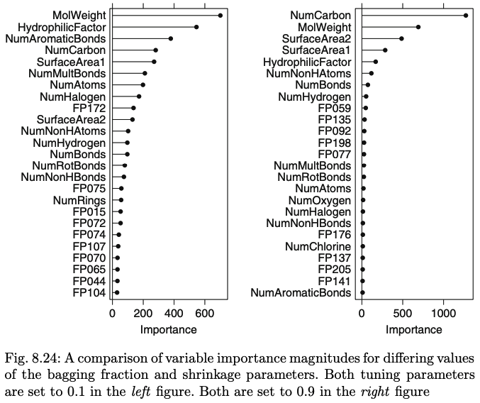

```{r setup, include=FALSE}
knitr::opts_chunk$set(echo = TRUE, warning=FALSE, message=FALSE)
options(scipen=999, digits = 4)

library(caret)
library(ggplot2)
library(kableExtra)
library(tidyverse)

set.seed(123)
kab_tab <- function(df){
  df %>% kable %>%
  kable_styling(bootstrap_options = c("striped", "hover", "condensed"), 
                full_width = T)
}
kab_tab2 <- function(df){
  df %>% kable %>%
  kable_styling(bootstrap_options = c("striped", "hover", "condensed"), 
                full_width = F)
}
```

## Exercise 8.1

Recreate the simulated data from Exercise 7.2:

```{r}
library(mlbench)
set.seed(200)
simulated <- mlbench.friedman1(200, sd = 1)
simulated <- cbind(simulated$x, simulated$y)
simulated <- as.data.frame(simulated)
colnames(simulated)[ncol(simulated)] <- "y"
```


### Part (a)  

Fit a random forest model to all of the predictors, then estimate the variable importance scores:

```{r}
library(randomForest)
library(caret)
model1 <- randomForest(y ~ ., data = simulated,
                       importance = TRUE,
                       ntree = 1000)
rfImp1 <- varImp(model1, scale = FALSE) %>%
  rownames_to_column("var") 
rfImp1 <- rfImp1[order(-rfImp1$Overall), , drop=FALSE] %>% remove_rownames()

kab_tab2(rfImp1)
```

###### Did the random forest model significantly use the uninformative predictors (`V6` – `V10`)?

No, the uninformative predictors, `V6` – `V10`, were the least important predictors in the random forest model and they were significantly less influential than the other 5 predictors, `V1` – `V5`, with the most important one `V6` at 0.17 having only about 25% the influence of `V3` the least influential of the top 5 at 0.67.

### Part (b) 

Now add an additional predictor that is highly correlated with one of the informative predictors. For example:

```{r}
simulated$duplicate1 <- simulated$V1 + rnorm(200) * .1
cor(simulated$duplicate1, simulated$V1)
```

Fit another random forest model to these data. 

```{r}
model2 <- randomForest(y ~ ., data = simulated,
                       importance = TRUE,
                       ntree = 1000)
rfImp2 <- varImp(model2, scale = FALSE) %>%
  rownames_to_column("var") %>% remove_rownames()
rfImp2 <- rfImp2[order(-rfImp2$Overall), , drop=FALSE]
rfImp1[11,] <- NA
tab1 <- cbind(rfImp1, rfImp2) %>% remove_rownames() 
tab1 <- tab1[c(2,1,4,3)]
colnames(tab1) <- c("Model_1", "Model_1_var", "Model_2", "Model_2_var")

kab_tab(tab1)
```

###### Did the importance score for `V1` change? 

Yes, the importance score for `V1` was reduced by the addition of a highly correlated variable and dropped down to second place.

###### What happens when you add another predictor that is also highly correlated with `V1`?

```{r}
simulated$duplicate2 <- simulated$V1 + rnorm(200) * .1
cor(simulated$duplicate2, simulated$V1)

model3 <- randomForest(y ~ ., data = simulated,
                       importance = TRUE,
                       ntree = 1000)

rfImp3 <- varImp(model3, scale = FALSE) %>%
  rownames_to_column("var") %>% remove_rownames()
rfImp3 <- rfImp3[order(-rfImp3$Overall), , drop=FALSE]
tab1[12,] <- NA
tab2 <- cbind(tab1, rfImp3) %>% remove_rownames() 
tab2 <- tab2[c(1:4,6,5)]
colnames(tab2)[c(5,6)] <- c("Model_3", "Model_3_var")

kab_tab(tab2)
```

Once again, the importance score for `V1` was reduced by the addition of a second highly correlated variable and dropped down to third place.  Most other variables importance values stayed almost the same, with the exception of `V3` which was also reduced by each additional variable, however their ranks changed.

### Part (c) 

Use the `cforest` function in the `party` package to fit a random forest model using conditional inference trees. The `party` package function `varimp` can calculate predictor importance. The `conditional` argument of that function toggles between the traditional importance measure and the modified version described in Strobl et al. (2007)^[Strobl C, Boulesteix A, Zeileis A, Hothorn T (2007). “Bias in Random Forest Variable Importance Measures: Illustrations, Sources and a Solution.”*BMC Bioinformatics*, **8**(1), 25.]. 

###### Do these importances show the same pattern as the traditional random forest model?

```{r cache=TRUE}
library(party)
data <- simulated[1:11]
CI_model <- cforest(y ~ ., data=data)

CI_Imp_T <- as.data.frame(varimp(CI_model, conditional = T)) %>%
  rownames_to_column("var") %>% remove_rownames()
CI_Imp_T <- CI_Imp_T[order(-CI_Imp_T$`varimp(CI_model, conditional = T)`), , drop=FALSE]

CI_Imp_F <- as.data.frame(varimp(CI_model, conditional = F)) %>%
  rownames_to_column("var") %>% remove_rownames()
CI_Imp_F <- CI_Imp_F[order(-CI_Imp_F$`varimp(CI_model, conditional = F)`), , drop=FALSE]

tab3 <- cbind(rfImp1[1:10,], CI_Imp_T, CI_Imp_F) %>% remove_rownames() 
tab3 <- tab3[c(2,1,4,3,6,5)]

colnames(tab3) <- c("Model_1", "Model_1_var", "CI cond=T", "CI_T_vars", "CI cond=F", "CI_F_vars")
kab_tab(tab3)
```

The conditional computation of importance flips the order of the first two variables as compared with the random forest model and the non-conditional computation.  There are also other differences in the pattern of importance that can be seen in the table above for instance the importance measure of `V3` drops significantly in the two conditional inference models.

### Part (d) 

Repeat this process with different tree models, such as boosted trees and Cubist. 

###### Does the same pattern occur?

#### Boosted Trees Model

```{r cache=TRUE}
library(gbm)
gbmGrid <- expand.grid(.interaction.depth = seq(1, 7, by = 2), 
                       .n.trees = seq(100, 1000, by = 50), 
                       .shrinkage = c(0.01, 0.1),
                       .n.minobsinnode = 10)

boost_model1 <- train(simulated[1:10], simulated$y, method = "gbm", 
                   tuneGrid = gbmGrid, verbose = FALSE)
boost_model2 <- train(simulated[-c(11,13)], simulated$y, method = "gbm", 
                   tuneGrid = gbmGrid, verbose = FALSE)
boost_model3 <- train(simulated[-11], simulated$y, method = "gbm", 
                   tuneGrid = gbmGrid, verbose = FALSE)

boost_imp1 <- data.frame(varImp(boost_model1)$importance) %>%
  rownames_to_column("var") %>% remove_rownames()
boost_imp1 <- boost_imp1[order(-boost_imp1$Overall), , drop=FALSE]
boost_imp2 <- data.frame(varImp(boost_model2)$importance) %>%
  rownames_to_column("var") %>% remove_rownames()
boost_imp2 <- boost_imp2[order(-boost_imp2$Overall), , drop=FALSE]
boost_imp3 <- data.frame(varImp(boost_model3)$importance) %>%
  rownames_to_column("var") %>% remove_rownames()
boost_imp3 <- boost_imp3[order(-boost_imp3$Overall), , drop=FALSE]
boost_imp1[c(11:12),] <- NA
boost_imp2[12,] <- NA
tab5 <- cbind(boost_imp1, boost_imp2, boost_imp3) %>% remove_rownames()
tab5 <- tab5[c(2,1,4,3,6,5)]
names(tab5) <- c("boost1", "var1", "boost2", "var2", "boost3", "var3")
kab_tab(tab5)
```

You can see in the table above that the order of importance changes in the boosted trees models when correlated predictors are added.  Although, unlike the random forest model, the top predictor never gets bumped out of the top slot.  In addition, the duplicate predictors never move above the 6th slot while in the random forest model they took the 4th and 5th slots.  

#### Cubist Model

```{r cache=TRUE}
library(Cubist)
cubist_model1 = train(simulated[1:10], simulated$y, method = "cubist") 
cubist_model2 = train(simulated[-c(11,13)], simulated$y, method = "cubist")  
cubist_model3 = train(simulated[-11], simulated$y, method = "cubist")  

cubist_imp1 <- data.frame(varImp(cubist_model1)$importance) %>%
  rownames_to_column("var") %>% remove_rownames()
cubist_imp1 <- cubist_imp1[order(-cubist_imp1$Overall), , drop=FALSE]
cubist_imp2 <- data.frame(varImp(cubist_model2)$importance) %>%
  rownames_to_column("var") %>% remove_rownames()
cubist_imp2 <- cubist_imp2[order(-cubist_imp2$Overall), , drop=FALSE]
cubist_imp3 <- data.frame(varImp(cubist_model3)$importance) %>%
  rownames_to_column("var") %>% remove_rownames()
cubist_imp3 <- cubist_imp3[order(-cubist_imp3$Overall), , drop=FALSE]
cubist_imp1[c(11:12),] <- NA
cubist_imp2[12,] <- NA
tab6 <- cbind(cubist_imp1, cubist_imp2, cubist_imp3) %>% remove_rownames()
tab6 <- tab6[c(2,1,4,3,6,5)]
names(tab6) <- c("cubist1", "var1", "cubist2", "var2", "cubist3", "var3")
kab_tab(tab6)
```

Of all the models tried, the cubist model changes the least when correlated predictors are added.  The top 3 slots stay the same in all three scenarios and the top 6 stay the same when only one correlated predictor is added.  The duplicate predictors also remain lower in the list in the 7th and 9th slots as compared with both the random forest model where they were in the 4th and 5th slots and the boosted model where they were in the 6th and 8th slots.   

## Exercise 8.2

Use a simulation to show tree bias with different granularities.

```{r}
set.seed(222)
x1_low <- sample(-1:1, 250, replace = T)
y <- x1_low + rnorm(250, mean=0, sd=1)
x2_mid <- x1_low + round(rnorm(250, mean=0, sd=1), 1)
x3_high <- x1_low + round(rnorm(250, mean=0, sd=1), 2)

df <- data.frame(cbind(x1_low, x2_mid, x3_high, y))
str(df)

library(rpart)
tree_mod <- rpart(y ~ ., data = df)

cor_to_y <- c(cor(x1_low, y), cor(x2_mid, y), cor(x3_high, y))
no_unique_vals <- c(length(unique(x1_low)), 
                    length(unique(x2_mid)), 
                    length(unique(x3_high)))
var_imp <- varImp(tree_mod)

tab7 <- cbind(cor_to_y, no_unique_vals, var_imp) 
names(tab7)[3] <- "importance"
kab_tab2(tab7)
```

In the simulation above you can see that the predictor with the highest number of distinct values was given the highest importance score even though it has a much lower correlation to the outcome.

## Exercise 8.3

In stochastic gradient boosting the bagging fraction and learning rate will govern the construction of the trees as they are guided by the gradient. Although the optimal values of these parameters should be obtained through the tuning process, it is helpful to understand how the magnitudes of these parameters affect magnitudes of variable importance. Figure 8.24 provides the variable importance plots for boosting using two extreme values for the bagging fraction (0.1 and 0.9) and the learning rate (0.1 and 0.9) for
the solubility data. The left-hand plot has both parameters set to 0.1, and the right-hand plot has both set to 0.9:



### Part (a) 

###### Why does the model on the right focus its importance on just the first few of predictors, whereas the model on the left spreads importance across more predictors?

The model on the right has a higher bagging parameter and so uses a larger random sample of the predictors at each iteration in the algorithm.  As a result more of the predictors can be filtered out as less influential at each stage in the process, whereas in the model on the right because it is using a much smaller random sample of predictors it cannot filter out as many predictors at each iteration and must use the ones it has so more of the predictors are used in the final combined model.  Also the variable importance is calculated by averaging the improvement value for that predictor across all trees in the ensemble.  So again the importance values will be higher when there are less predictors to choose from in each tree because they cannot be filtered out.  Whereas these same predictors  might be filtered out as less influential when there are more predictors to choose from.  

### Part (b) 

###### Which model do you think would be more predictive of other samples?

I would think that the model with the lower bagging fraction and learning rate would be a better predictor of new samples since it has a heavier reliance on a larger sample of the predictors and since lower learning rates were recommended because they build up the predictions more slowly through more iterations. 

### Part (c) 

###### How would increasing interaction depth affect the slope of predictor importance for either model in Fig. 8.24?

Increasing tree depth spreads the importance out over more predictors as the number of nodes increases.  So increasing the depth should cause the predictors with higher importance values to be lessened and the ones with lower values to be increased, thus flattening the curve in the slope of predictor importance in either model.  

## Exercise 8.7

Refer to Exercises 6.3 and 7.5 which describe a chemical manufacturing process. Use the same data imputation, data splitting, and steps as before and train several tree-based models:

```{r}
library(AppliedPredictiveModeling)
data(ChemicalManufacturingProcess)

imputer <- preProcess(ChemicalManufacturingProcess, method = "knnImpute")
CMP_imputed <- predict(imputer, ChemicalManufacturingProcess)

near0 <- nearZeroVar(CMP_imputed)
cmp <- CMP_imputed[,-near0]

trainingRows <- createDataPartition(cmp$Yield, p = .80, list= FALSE)

train <- cmp[trainingRows, ]
trainx <- train[,-1]
trainy <- train$Yield
test <- cmp[-trainingRows, ]
testx <- test[,-1]
testy <- test$Yield
```

### Random Forest

```{r}
set.seed(123)
RF_grid <- expand.grid(mtry=seq(7,49,by=3))
RF_mod <- train(trainx, trainy, method = "rf", 
                tuneGrid = RF_grid)

RF_imp <- varImp(RF_mod, scale = FALSE) #
RF_imp <- RF_imp$importance %>% rownames_to_column("var") 
RF_imp <- RF_imp[order(-RF_imp$Overall), , drop=FALSE] %>% remove_rownames()

plot(RF_mod)
kab_tab2(head(RF_imp,12))
```

### Gradient Boost Machine

```{r cache=TRUE, fig.height=12, fig.width=10}
library(gbm)
gbmGrid2 <- expand.grid(.interaction.depth = seq(1, 7, by = 2), 
                       .n.trees = seq(100, 1000, by = 100), 
                       .shrinkage = c(0.005, 0.01, 0.1, 0.2),
                       .n.minobsinnode = seq(5, 16, by = 5))

boost_mod <- train(trainx, trainy, method = "gbm", 
                   tuneGrid = gbmGrid2, verbose = FALSE)

boost_imp <- data.frame(varImp(boost_mod)$importance) %>%
  rownames_to_column("var") 
boost_imp <- boost_imp[order(-boost_imp$Overall), , drop=FALSE] %>%
  remove_rownames()

plot(boost_mod)
kab_tab2(head(boost_imp,12))
```


### Cubist Model

```{r cache=TRUE}
cub_grid <- expand.grid(committees = c(1,5,10,20,40,80), neighbors = c(0,1,3,5,7,9))
cubist_mod = train(trainx, trainy, method = "cubist", tuneGrid = cub_grid) 

cubist_imp <- data.frame(varImp(cubist_mod)$importance) %>%
  rownames_to_column("var")
cubist_imp <- cubist_imp[order(-cubist_imp$Overall), , drop=FALSE] %>%
  remove_rownames()

plot(cubist_mod)
kab_tab2(head(cubist_imp,12))
```

### Part (a) 

#### Model Comparison

Which tree-based regression model gives the optimal resampling and test set performance?

##### Resampling Performance

```{r}
RF_pred_train <- predict(RF_mod)
boost_pred_train <- predict(boost_mod)
cubist_pred_train <- predict(cubist_mod)

kab_tab2(data.frame(rbind(postResample(pred = cubist_pred_train, obs = trainy), 
                         postResample(pred = boost_pred_train, obs = trainy),
                         postResample(pred = RF_pred_train, obs = trainy)),
                   row.names =  c("Cubist","Gradient Boost", "Random Forest")))
```

##### Test Set Performance

```{r}
RF_pred <- predict(RF_mod, newdata = testx)
boost_pred <- predict(boost_mod, newdata = testx)
cubist_pred <- predict(cubist_mod, newdata = testx)

kab_tab2(data.frame(rbind(postResample(pred = cubist_pred, obs = testy), 
                         postResample(pred = boost_pred, obs = testy),
                         postResample(pred = RF_pred, obs = testy)),
                   row.names =  c("Cubist","Gradient Boost", "Random Forest")))
```

```{r}
cubist_mod
kab_tab2(cubist_mod$bestTune)
```

The cubist model gives the best (lowest) RMSE and MAE values for both the resampling and the test set predictions, as well as the highest $R^2$ (although you really shouldn't use the $R^2$ statistic to compare across different types of models, only to compare different tuning parameters for the same model).

Although the model chosen by the algorithm was the 80 committee and 1 neighbor model you can see in the cubist model plot above that there is little gained after 40 committees, so the 40 committee and 1 neighbor model may be selected instead to limit the complexity.

### Part (b) 

###### Which predictors are most important in the optimal tree-based regression model? 

###### Do either the biological or process variables dominate the list? 

###### How do the top 10 important predictors compare to the top 10 predictors from the optimal linear and nonlinear models?

```{r}
kab_tab2(head(cubist_imp,10))
```

The manufacturing processes still dominate the list taking the top 4 slots, however, like the optimal nonlinear model 4 of the top 10 are biological materials (and 2 of the top 6) are biological materials so they are not completely absent like they were in the optimal linear model.  The same two predictors came out on top in the optimal tree model as in the nonlinear model, `ManufacturingProcess32` and `ManufacturingProcess13`, although in reverse order.  The next two most influential variables, `ManufacturingProcess29` and `ManufacturingProcess31` came out much lower in the nonlinear list at ranks 11 and 17 respectively.  

### Part (c) 

Plot the optimal single tree with the distribution of yield in the terminal nodes. 

First we'll have to train a model since we haven't trained a single tree model yet!

```{r fig.height=10, fig.width=10}
set.seed(123)
ctrl <- trainControl(method = "cv", number = 10)
tree_grid <- expand.grid(maxdepth= seq(1,15, by=1))
tree_mod <- train(trainx, trainy, method = "rpart2", 
                  tuneGrid = tree_grid, trControl = ctrl)

library(partykit)
plot(as.party(tree_mod$finalModel), gp=gpar(fontsize=11))
```

###### Does this view of the data provide additional knowledge about the biological or process predictors and their relationship with yield?

The most notable insight that stands out in the tree plot is that the distributions for all the nodes on the left branch of the top split on `ManufacturingProcess32` except for one are lower than all of the distributions for the right side branch.  You can clearly see why that split was made and why that variable consistently comes out on or near the top of the list of importance.

### Footnotes