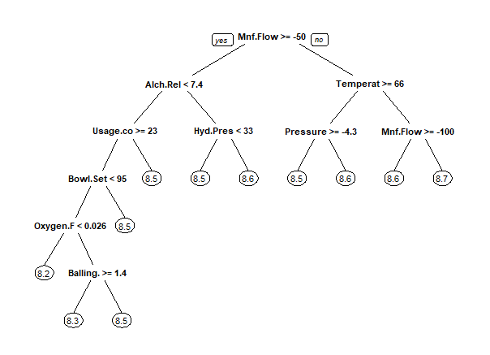
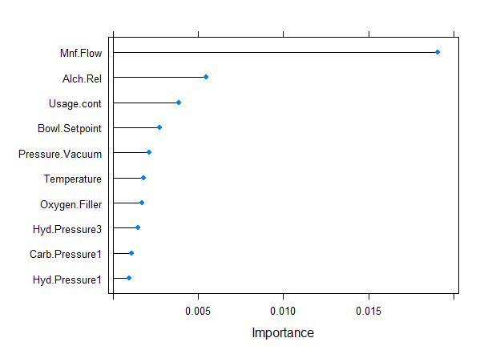
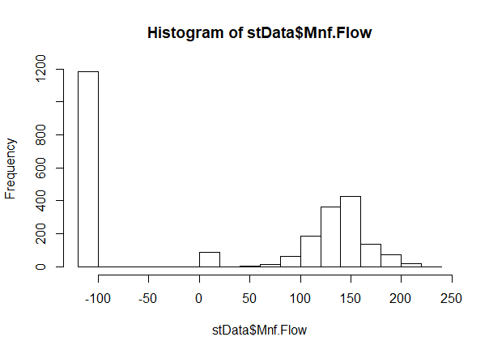
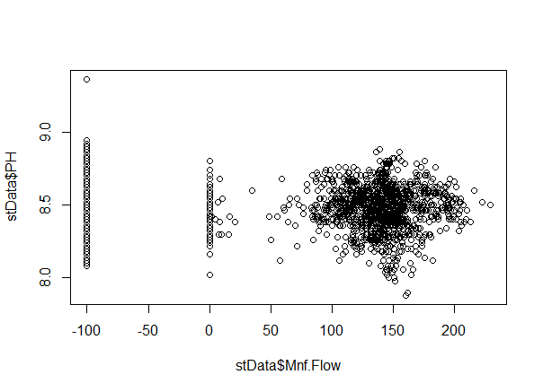
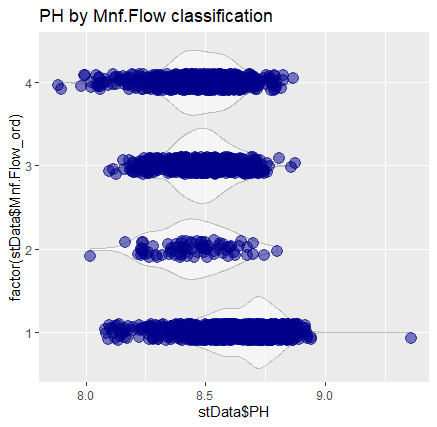

```{r setup, include=FALSE, echo=FALSE}
knitr::opts_chunk$set(echo = FALSE)
#include essential packages and code for presentation, if needed
```

## Data Analytics of ABC Beverage Manufacturing Process

This report has the following aims:

* to further senior management's general understanding of the ABC Beverage manufacturing process from a data analytics perspective;
* to internally prepare for inquiries and procedures pursuant to recent changes in the regulatory environment;
* specifically, to explicate the effect manufacturing processes have on beverage pH and a generalized model for predicting pH levels from input and process calibrations. 


## Production Process Overview

We were given a dataset that consisted of 31 numerical predictor variables detailing a wide range of production processes, 1 categorical variable `Brand.Code`, and our target variable, `PH`.  Full summary statistics for these variables can be seen in the detailed appendix. Here are the distributions of the various variables of concern:


```{r, echo=FALSE, fig.cap="Distribution of manufacturing process calibrations", out.width = '100%'}
knitr::include_graphics("images/vardist.png")
```


## Correlation between Production Metrics

```{r, echo=FALSE, out.width = '100%'}
knitr::include_graphics("images/corrplot.png")
```

We observe strong correlation (>80%) between the following pairs:

```{r, echo=FALSE, fig.height=80}
knitr::include_graphics("images/highcorr.png")
```

## A Predictive Model for pH

```{r, echo=FALSE, fig.cap="Summary of pH statistics", out.width = '100%'}
knitr::include_graphics("images/pH.png")
```

We seek to consult a model that minimized error (measured as root mean squared error or RMSE) and maximized predictive value (measured as R-squared).

The Random Forest model achieved this. The Random Forest regression model is a machine learning technique that randomly leaves out candidate features from each decision tree split, run on multiple iterations. In doing so, it "decorrelates" the trees, such that the averaging process can reduce the variance of the resulting models. 

Our result (when applying roughfix to missing values) was: 
RMSE: 0.109   
RSQUARED: 0.625   

    

## Sample Decision Tree

The decision tree below is achieved through a method called recursive partitioning. It is one snapshot of what a random forest mdoel might look like. Here, we can observe that the most critical factor Mnf.Flow is at the top and largely negative values are associated with higher pH, especially when temperature is less than 66 degrees. To achieve lower pH we have Alch.Rel < 7.4, Usage.cont >= 23, Bowl.Setpoint < 95 and either Oxygen.Filler < 0.026 (pH = approx. 8.2) or Balling.Lvl >- 1.4 (pH approx 8.3).

```{r, echo=FALSE, out.width = '100%'}

```


## Most Important Processes in pH Determination

We rank the top-ten most important variables in determining pH according to the Random Forest Model.

```{r, echo=FALSE, fig.cap="Most important variables (by Random Forest)", out.width = '100%'}

```


## Comparison to standard OLS linear regression

When we compare the Adjusted-RSQUARED 'goodness of fit' measure of the a conventional linear regression model that uses takes these ten variables as input to one which uses all the variables as inputs, we note a loss of only 2.8% goodness-of-fit (0.356 to 0.328) when we reduce the original 31 numerical features to 10. We further enhance the linear model by removing the insignificant Pressure.Vacuum and Hyd.Pressure1, to arrive at the statistics below:

```{r, echo=FALSE, out.width = '90%'}
knitr::include_graphics("images/LinReg.png")
```

This table is interesting in that it shows a starting pH of 8.95, with reductions made by those variable with the negative coefficients, i.e. Mnf.Flow, Usage.conf, Temperature, Oxygen.Filler; 

There is positive adjustment from those variables with positive coefficients, i.e. Alch.Rel, Bowl.Setpoint, Hyd.Pressure3, Carb.Pressure;

## Understanding Mnf.Flow (1)

As in several models, it is considered the most critical input, we visualize the distribution of the Mnf.Flow data in a histogram and a scatterplot with PH:

```{r, echo=FALSE, out.width = '70%'}

```

```{r, echo=FALSE, out.width = '70%'}

```

## Understanding Mnf.Flow (2)

We make the following observations about Mnf.Flow:

* (1) Of the 2567 observations in our training set, 1183 (46%) have a value of -100 or less.

* (2) The negative influence is apparent in this violinplot, separated by buckets of Mnf.FLow in the following ranges {1: [-1000, -1), 2: [-1, 1), 3: [1, 140), 4: [140, 1000]}

```{r, echo=FALSE, out.width = '70%'}

```

## Understanding Mnf.Flow (3)

* (3) We note that the mean value of all non-negative Mnf.Flow data is 140. 

* (4) A disproporational number of our missing values come from observations in which the Mnf.Flow is between 0 and 1. Although only 3% of all observations have this range of Mnf.Flow, 18% of the observations with missing values come from this subset. 

## Most Important Variable by Brand (1)

We further separate the data by brands. 

```{r}
knitr::include_graphics(c("images/BrandFreq.png","images/Brands.png"))
```


We list the top-five most important variables according to brand type

```{r, echo=FALSE, out.width = '50%'}
knitr::include_graphics(c("images/BrandA.png","images/BrandB.png","images/BrandA.png","images/BrandB.png"))
```


## Most Important Variable by Brand (2)

We notice the following consistencies and discrepancies between the brand-specific models and the general model:


## Predictions

See attached Excel file for predictions of pH applying our Random Forest model. We see that our predictors fall close to the line.


```{r, echo=FALSE, out.width = '50%'}
knitr::include_graphics(c("images/gof.png"))
```

## Conclusions

* The main processes putting downward (acetic) pressure on pH are Mnf.Flow, Usage.conf, Temperature, Oxygen.Filler when increased; Positive adjustment may be attained through increase in Alch.Rel, Bowl.Setpoint, Hyd.Pressure3, Carb.Pressure;

* There is strong correlation between several of the manufacturing processes, in particular: MFR, Hyd.Pressure2, Carb.Rel, Air.Pressurer, Carb.Flow, Hyd.Pressure4, and Filler.Level;

* Some of the observations have missing data in our predictors, most noticeably in MFR, which had 8.25% missing values, as well as Mnf.Flow when in the range of 0 to 1. 

